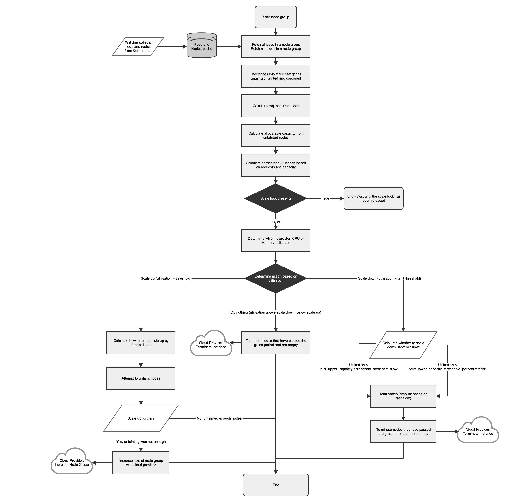

# Documentation
General system documentation
*Design is very early and subject to change at anytime*

# Dependencies
We used `godep` for dependency managment
## Install: 
- `go get github.com/tools/godep`
## To add a package: 
1. `go get your.package/name`
2. add `import "your.package/name"` to your code
3. `godep save ./...`
This should add the package to the vendor/ folder

# System Algorithm Design
The initial algorithm is designed to be as simple as possible to achieve our goal

## Very short summary
- The autoscaler is designed as a static autoscaler. 
- Start watching all pods in the cluster, including pending pods
- Every tick the autoscaler will check the overall cluster utilisation and make a decision whether to do nothing, scale up, or start making nodes unschedulable.
    - On a scale up event
        - determine how many nodes are needed to fit the workload
        - try making MARKED nodes schedulable first
        - increase the ASG size by the remaining nodes
    - On a scale down event
        - determine how many nodes are unneeded
        - MARK (taint/cordon) the nodes so they become unschedulable
        - Set a grace period for the node
- A reaper routine will routinely check for MARKED nodes with no running pods and terminate them if the grace period has expired

# System Architecture
Basic idea of System Architecture. Subject to chage dramatically. Update image when design changes

# Packages Layout and Usages
